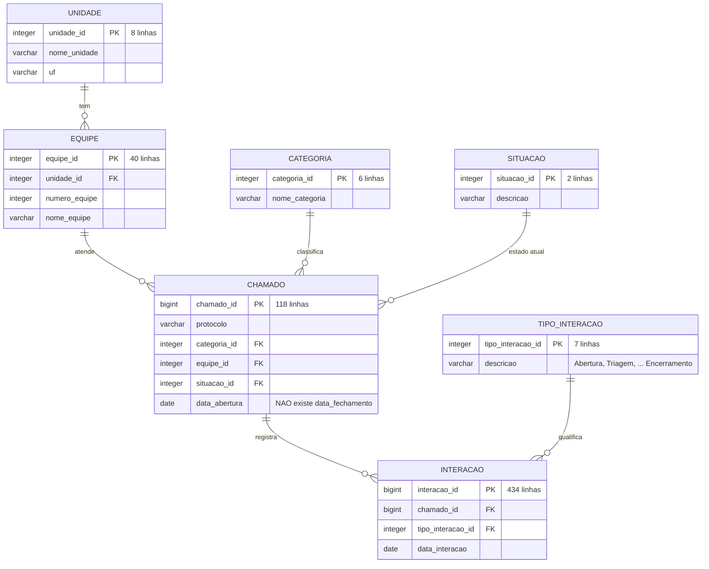
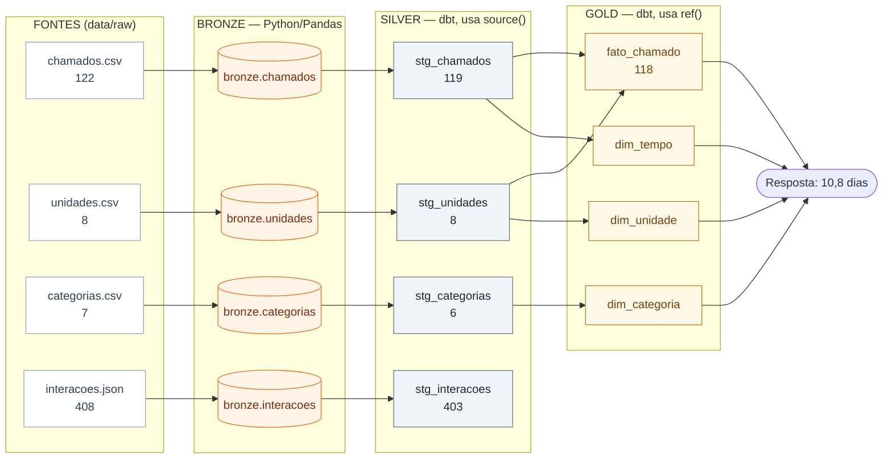
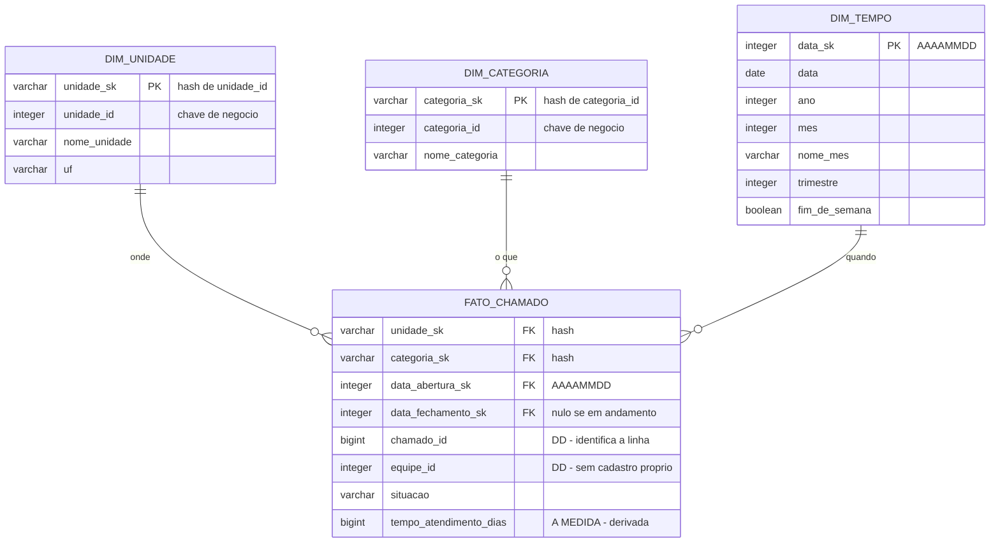
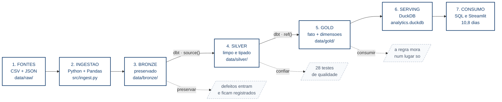

# Diagramas

Os diagramas desta PoC são **Mermaid** — diagrama como código. São arquivos de texto
(`.mmd`), então versionam no Git, aparecem no `git diff` quando mudam, e não dependem
de nenhuma ferramenta de desenho.

É a mesma ideia que a aula defende para o SQL: se o pipeline é código, o desenho do
pipeline também deveria ser.

## Como visualizar

### O jeito mais rápido: este próprio arquivo

Instale a extensão **Markdown Preview Mermaid Support** (`bierner.markdown-mermaid`):
`Cmd+Shift+X`, buscar pelo nome, instalar.

Depois **abra este `README.md` e aperte `Cmd+Shift+V`** — os quatro diagramas aparecem
renderizados de uma vez, com a explicação de cada um.

⚠ **Essa extensão NÃO renderiza arquivos `.mmd`.** Ela só adiciona Mermaid ao preview de
Markdown. Se você abrir um `.mmd`, vai ver só o texto — é o comportamento esperado.

### Para pré-visualizar um `.mmd` direto

Aí precisa de outra extensão:

- **Mermaid Chart** (`MermaidChart.vscode-mermaid-chart`) — a oficial. Abre o `.mmd` e
  aparece um botão de preview no canto superior direito.
- **Mermaid Preview** (`vstirbu.vscode-mermaid-preview`) — mais leve.
  `Cmd+Shift+P` → "Mermaid: Preview".

### Sem instalar nada: `ver-diagramas.html`

**Dê duplo clique em `diagramas/ver-diagramas.html`.** Ele abre no navegador e renderiza
os quatro diagramas, sem depender de extensão nenhuma do VS Code. É a saída garantida
quando o preview do Markdown não coopera.

Precisa de internet na primeira vez (o Mermaid vem de um CDN). Se você editar um `.mmd`,
rode `python diagramas/gerar_html.py` para atualizar a página.

E para gerar imagem para um slide: copie o conteúdo do `.mmd` e cole em
<https://mermaid.live> — renderiza na hora e exporta PNG ou SVG.

### No GitHub

Blocos ` ```mermaid ` em arquivos `.md` renderizam sozinhos. Por isso os quatro diagramas
estão embutidos aqui embaixo, além de existirem como `.mmd` — o `.mmd` é a fonte, este
README é a vitrine.

---

## 1. O modelo relacional da origem

O sistema que gerou os nossos quatro arquivos: normalizado, orientado a eventos.
Reproduzível com `python scripts/criar_oltp_simulado.py`.

Dois pontos que a aula explora:

- **`chamado` não tem `data_fechamento`** — o fechamento é uma interação do tipo
  "Encerramento". É por isso que a medida precisa ser derivada.
- **A unidade vem via equipe** — não existe `unidade_id` no chamado, o que obriga a
  consulta OLTP a dois joins encadeados.



**O que a origem exportou.** Os quatro arquivos de `data/raw/` são *exports
desnormalizados* deste modelo:

| Arquivo | Vem de | Linhas |
|---|---|---|
| `chamados.csv` | `chamado` + `equipe.unidade_id` + `situacao.descricao` + a data de fechamento derivada da interação | 122 |
| `unidades.csv` | `unidade` | 8 |
| `categorias.csv` | `categoria` — **com 1 id duplicado**, que o banco jamais teria permitido | 7 |
| `interacoes.json` | `interacao` + `tipo_interacao.descricao` | 408 |

O export achata o modelo: some a normalização, somem as chaves estrangeiras — e some a
garantia que o banco dava. É daí que nasce a necessidade dos testes.

---

## 2. A DAG do pipeline

O grafo que o dbt **deduz** dos `source()` e `ref()`. Ninguém escreve a ordem de
execução em lugar nenhum.

Confere com `cd dbt && dbt docs generate && dbt docs serve`, ou direto em
`dbt/target/manifest.json`.



Repare em duas coisas:

- **A fato não aponta para as dimensões.** Ela depende de `stg_chamados` e
  `stg_unidades`, e só. Estrela é modelo *lógico* (como consultar); DAG é ordem de
  *construção*. O encontro entre fato e dimensão acontece na consulta.
- **A `dim_tempo` depende de `stg_chamados`** — não porque a fato precise dela, mas
  porque ela usa a menor e a maior data dos chamados para saber que intervalo de
  calendário gerar.

---

## 3. O modelo dimensional da Gold

O star schema implementado. Grão: uma linha = um chamado (118 linhas, 94 com medida).



**Só as chaves de dimensão ganham surrogate key.** A fato não tem SK própria: com grão
de um chamado por linha, o `chamado_id` degenerado já identifica a linha, e um hash
dele seria a mesma informação duas vezes.

- `unidade_sk` e `categoria_sk` são **hash** da chave de negócio
  (`dbt_utils.generate_surrogate_key`) — determinístico, igual em qualquer run, o que
  importa num pipeline idempotente.
- `data_sk` é a exceção: **smart key `AAAAMMDD`**, a única SK "com significado" que o
  Kimball aceita, porque é legível, ordena cronologicamente e filtra por faixa sem join.
- `data_abertura_sk` e `data_fechamento_sk` apontam para a **mesma** `dim_tempo`, em
  papéis diferentes — é o *role-playing*.

---

## 4. A jornada do dado

O mapa da aula: sete etapas, cada uma virando código executável.



---

## Gerar imagem para os slides

O jeito mais rápido é o <https://mermaid.live>: cole o `.mmd`, ajuste o tema se quiser,
e exporte PNG ou SVG.

Por linha de comando, se preferir automatizar:

```bash
npm install -g @mermaid-js/mermaid-cli
mmdc -i diagramas/01-modelo-relacional-origem.mmd \
     -o diagramas/01-modelo-relacional-origem.png \
     -b white -s 3
```

O `-s 3` triplica a resolução — necessário para projeção.

## Manter os diagramas honestos

O diagrama 2 (a DAG) é o único que pode divergir do código sem ninguém perceber, porque
o dbt deduz o grafo sozinho. Para conferir:

```bash
cd dbt && dbt docs generate && dbt docs serve
```

Se o grafo do `dbt docs` e o `.mmd` discordarem, **o `.mmd` é que está errado**.
